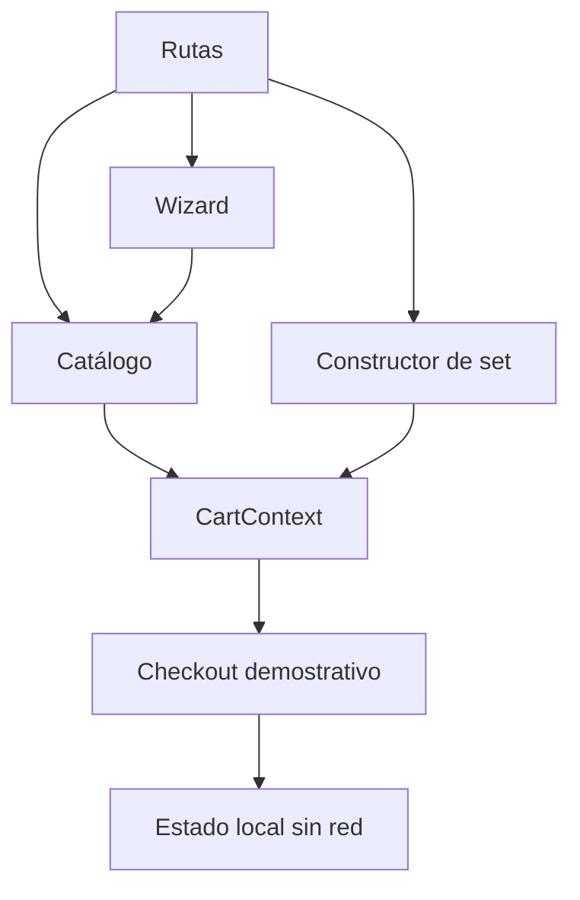

# Misionero — e-commerce experimental

Demo de e-commerce para productos materos que explora descubrimiento guiado, armado de sets, personalización y carrito. El proyecto prioriza una experiencia clara y visual sin fingir capacidades de comercio real.

> **Alcance:** catálogo, precios, testimonios, sucursal y logística son ficticios. No hay backend, inventario, cuentas, pedidos ni pagos. El checkout nunca solicita datos de tarjeta y termina como una demostración local.

## Problema y solución

Elegir un mate y sus accesorios puede requerir más guía que una grilla tradicional. La aplicación combina varios caminos:

- catálogo y detalle de producto;
- wizard determinístico de recomendación;
- constructor de sets;
- simulación de personalización con texto o una imagen local;
- carrito compartido;
- checkout de UI explícitamente no transaccional;
- formulario de contacto con validación local.

## Stack

- React 19 y TypeScript
- React Router 7
- Vite 8
- Tailwind CSS 3 compilado localmente
- Lucide React

## Arquitectura



La recomendación es una regla determinística y auditable sobre respuestas del usuario; no utiliza IA. El carrito vive en memoria y se reinicia con la sesión.

## Ejecutar localmente

Requiere Node.js `^20.19` o `^22.12`.

```bash
npm ci
npm run dev
```

Verificación:

```bash
npm run typecheck
npm run build
npm audit
```

No se requieren variables de entorno.

## Seguridad y privacidad

- se retiró la captura de PAN, vencimiento y CVC de tarjeta;
- el checkout explica que no procesa pagos ni envía datos;
- los formularios no tienen transporte ni persistencia;
- uploads limitados a JPG/PNG de hasta 5 MB y usados solo como señal local;
- Tailwind ya no se carga mediante el CDN de desarrollo;
- se eliminó configuración de Gemini no utilizada;
- dependencias auditadas sin advisories conocidos.

## Limitaciones conocidas

- no hay motor de recomendación entrenado: el wizard aplica reglas locales;
- no se valida stock, dirección, entrega ni identidad;
- el archivo de personalización no se sube ni se conserva;
- imágenes del catálogo requieren conexión;
- no existe suite automatizada; se verifican tipos, build y dependencias.

## Estructura

```text
pages/        catálogo, wizard, builder, checkout y contenido
components/   navegación, carrito y elementos compartidos
constants.ts  dataset ficticio y reglas de precio
App.tsx       router, contexto del carrito y composición
```

## Estado de demo

No hay un deployment público verificado. Ejecutar localmente para evaluarlo.

## Autor

Desarrollado por [Nicolás De Felippe](https://github.com/nicodf91) como proyecto de portfolio.
